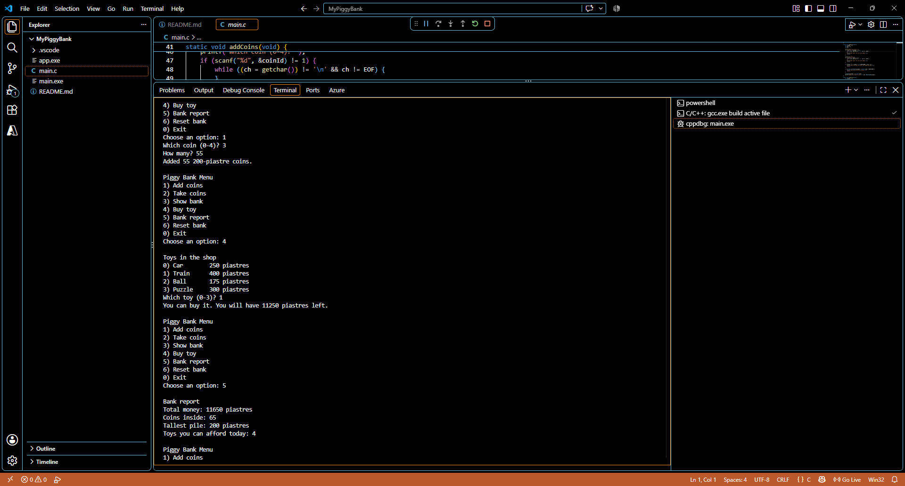

## name : Tasneem Hossam El-Din Hassan Salem

## email : tasneem.hossameldin@outlook.com

# Project 1 — My Piggy Bank

This program implements the Piggy Bank project from the practice brief. It keeps track of coin counts, shows the current bank, checks toy affordability, and prints a summary report.

## Build

```bash
gcc -std=c99 -Wall -Wextra -o app main.c
```

## Run

```bash
./app
```

## Notes

- The program starts with a small seeded bank and a few toy prices.
- Invalid menu input is rejected politely instead of crashing.
- Any attempt to take out more coins than available is refused without changing the bank.
- The recursive `sumCoins()` function adds array values without using a loop.



